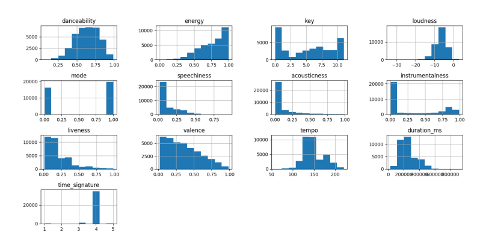
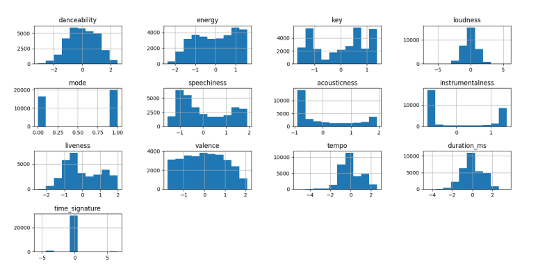
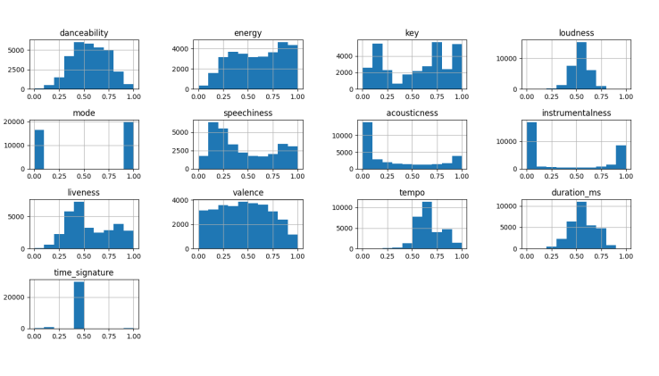
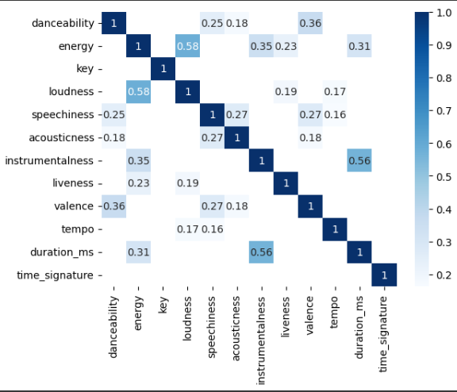
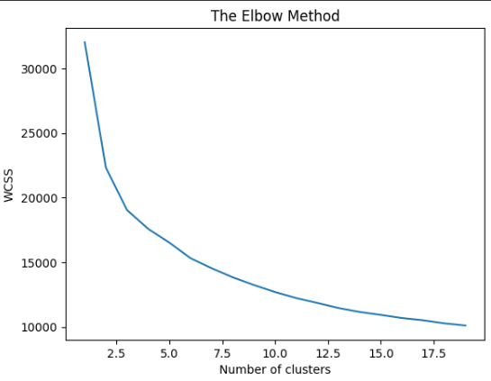

# Spotify Music Recommendation System
In this project I performed clustering on the Spotify dataset and developed a recommendation system for the users. I had a dataset of songs and their features like danceability, energy, etc. The goal was to perform clustering on the dataset and then recommend songs to the users based on the clusters.

## Task: Clustering

At first the given data contains 42305 rows and 22 columns, where
the columns are as follow:

 **acousticness**: number<float> 

A confidence measure from 0.0 to 1.0 of whether the track is acoustic. 1.0 represents high confidence the track is acoustic.

 **analysis_url**: string 

 **danceability**: number<float> 

Danceability describes how suitable a track is for dancing based on a combination of musical elements including tempo, rhythm stability, beat strength, and overall regularity. **A value of 0.0 is least danceable and 1.0 is most danceable.**

 **duration_ms**: integer 

The duration of the track in milliseconds.

 **energy**: number<float> 

**Energy is a measure from 0.0 to 1.0** and represents a perceptual measure of intensity and activity. Typically, energetic tracks feel fast, loud, and noisy. For example, death metal has high energy, while a Bach prelude scores low on the scale.
Perceptual features contributing to this attribute include dynamic range, perceived loudness, timbre, onset rate, and general entropy.

  **id**: string 

The Spotify ID for the track.

 **instrumentalness**: number<float> 

Predicts whether a track contains no vocals. "Ooh" and "aah" sounds are treated as instrumental in this context. Rap or spoken word tracks are clearly "vocal". The closer the instrumentalness value is to 1.0, the greater likelihood the track contains no vocal content. Values above 0.5 are intended to represent instrumental tracks, but confidence is higher as the value approaches 1.0.

 **key**: integer 

The key the track is in. Integers map to pitches using standard Pitch Class notation. E.g. 0 = C, 1 = C♯/D♭, 2 = D, and so on. If no key was detected, the value is -1.

 **liveness**: number<float> 

Detects the presence of an audience in the recording. Higher liveness values represent an increased probability that the track was performed live. A value above 0.8 provides strong likelihood that the track is live.

 **loudness**: number<float> 

The overall loudness of a track in decibels (dB). Loudness values are averaged across the entire track and are useful for comparing relative loudness of tracks. Loudness is the quality of a sound that is the primary psychological correlate of physical strength (amplitude). Values typically range between -60 and 0 db.

 **mode**: integer 

Mode indicates the modality (major or minor) of a track, the type of scale from which its melodic content is derived. Major is represented by 1 and minor is 0.

 **speechiness** : number<float> 

Speechiness detects the presence of spoken words in a track. The more exclusively speech-like the recording (e.g. talk show, audio book, poetry), the closer to 1.0 the attribute value. Values above 0.66 describe tracks that are probably made entirely of spoken words. Values between 0.33 and 0.66 describe tracks that may contain both music and speech, either in sections or layered, including such cases as rap music. Values below 0.33 most likely represent music and other non-speech-like tracks.

 **tempo**: number<float> 

The overall estimated tempo of a track in beats per minute (BPM). In musical terminology, tempo is the speed or pace of a given piece and derives directly from the average beat duration.

 **time_signature**: integer 

An estimated time signature. The time signature (meter) is a notational convention to specify how many beats are in each bar (or measure). The time signature ranges from 3 to 7 indicating time signatures of "3/4", to "7/4".

>= 3<= 7

 **track_href**: string 

A link to the Web API endpoint providing full details of the track.

 **type**: string 

The object type.

Allowed value:"audio_features"

 **uri**: string 

The Spotify URI for the track.

 **valence**: number<float> 

A measure from 0.0 to 1.0 describing the musical positiveness conveyed by a track. Tracks with high valence sound more positive (e.g. happy, cheerful, euphoric), while tracks with low valence sound more negative (e.g. sad, depressed, angry).

 **genre**: string 

## Data Preprocessing

1. Data Cleaning 

Removing unnecessary columns:

columns 'type', 'uri', 'track_href', 'analysis_url' and 'genre' are not going to be useful for us, even genre will not appear in our input so it doesn’t help that much. I’m going to drop all mentioned columns.

Handling missing data:

In columns 'song_name', 'Unnamed: 0' and 'title' we see lots of NaNs, in addition to that they are not going to be helpful for the clustering part, so I, going to drop these columns too.

It was previously mentioned that if the ‘key’ is not detected, its value is -1, it might be a good way of handling the missing data, but it can ruin our upcoming clustering. So I’m going to drop all the rows whose ‘key’ is -1.

Removing Duplicates:

It seems that we have a lot of repeated rows too. I’m going to drop
them as well.

After all these data cleanings we have 36199 rows and 14 columns, all the columns are numerical but ‘id’ which is string. I keep this column because when I want to recommend a song to a user, I’m going to use it, But when clustering I temporarily drop it, so that it doesn’t have an effect on the result.

2. Data Transformation

Now Let’s take a look at histogram plots of our data:

If we want to use K-means, the distribution should be symmetric. As we can observe from the plot above, most of the features have a skewed distribution. So we should standardize them.

As many of our variables have left skewness a method like logarithm cannot help. Box-Cox is not useful either because its inputs are just positive numbers. I used Yeo-Johnson at last.The result is as follows:  (point: The variable ‘mode’ is categorical. So I didn’t use the method for that.)

After Normalizing the result is as follows:

3. Data Reduction

Before moving on to clustering let’s just make sure about another thing: For a better result, we should find highly correlated variables, and if there are any, we should drop them.

None of the correlations are not very noticable. So we keep all of them. Now our data is ready to be clustered.

## Clustering:

I am going to use K-means algorithm which is an unsupervised one. An important point about K-means, is that before running, it should be told about the value of k, which is the number of clusters that we want to have. I will use the elbow method to find the optimum number of clusters.

It can be concluded thaat **10 clusters** can work well. After clustering now I can handle the input/output part of the project.

